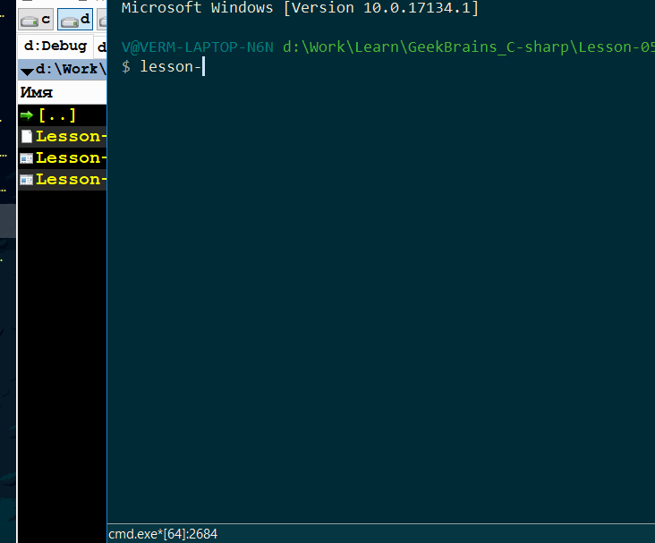
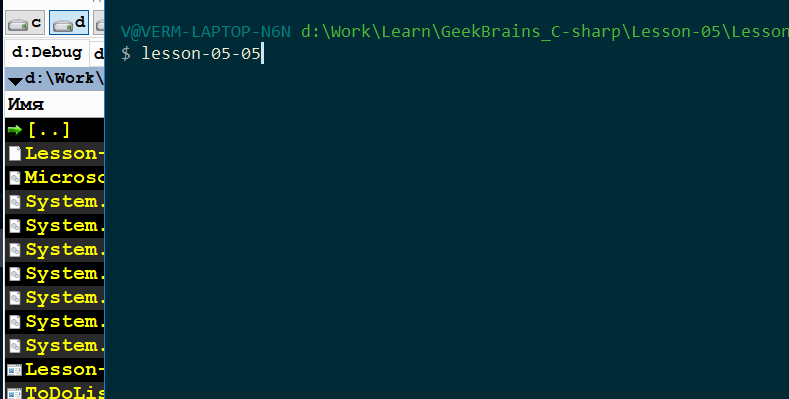

*[Назад](./../README.md)*  
  
### Задание для урока №5  
  
- [X] 1 Ввести с клавиатуры произвольный набор данных и сохранить его в текстовый файл.  
- [X] 2 Написать программу, которая при старте дописывает текущее время в файл «startup.txt».  
- [X] 3 Ввести с клавиатуры произвольный набор чисел (0...255) и записать их в бинарный файл.  
- [X] 4 (*) Сохранить дерево каталогов и файлов по заданному пути в текстовый файл — с рекурсией и без.  
- [X] 5 (*) Список задач (ToDo-list):  
```cs  
написать приложение для ввода списка задач;  
задачу описать классом ToDo с полями Title и IsDone;  
на старте, если есть файл tasks.json/xml/bin (выбрать формат), загрузить из него массив имеющихся задач и вывести их на экран;  
если задача выполнена, вывести перед её названием строку «[x]»;  
вывести порядковый номер для каждой задачи;  
при вводе пользователем порядкового номера задачи отметить задачу с этим порядковым номером как выполненную;  
записать актуальный массив задач в файл tasks.json/xml/bin.  
```  
  
---  
  
### Пояснения по выполнению задания  
  
1) Добавил проверку на то существует ли уже текстовый файл. И если существует, то пользователю 
дается выбор что делать с файлом ("перезаписать/добавить/ничего не делать").  
  
2) Сделал проверку - если файл уже существует, то перед записью даты времени, в него записывается перенос строки.  
  
3) Т.к. стоит задача просто записать байты в файл, то обошелся без сериализации, обычным BinaryWriter  
  
4) Сделал вариант с рекурсией и без нее.  
  
  
  
5) Сделал 2 класса один ToDo, который описывает задачу, 
и второй TaskList, который содержит список задач и методы для работы с ними 
(добавление/удаление/изменение заданий и т.д)  
Сериализация и десереализация списка задач в JSON делается через методы самого TaskList, 
а работа с файлами в основном классе в Main  
Работу со списком организовал через меню в котором можно добавлять/удалять/изменять задания в списке  
А так же загружать и выгружать список заданий на диск (загрузку сделал не автоматической, а по команде пользователя)  
  
Работу со списком сделал через список(List), потому-что он удобнее для этих целей чем массив, 
плюс по условию задачи массив надо считать из файла и записать его в файл, 
а в каком виде работать с ним в программе, не оговорено.  
А также, при сериализации в JSON, и список и массив выглядят абсолютно одинаково 
и информацию спокойно можно будет загрузить и туда и туда.  
  
  
