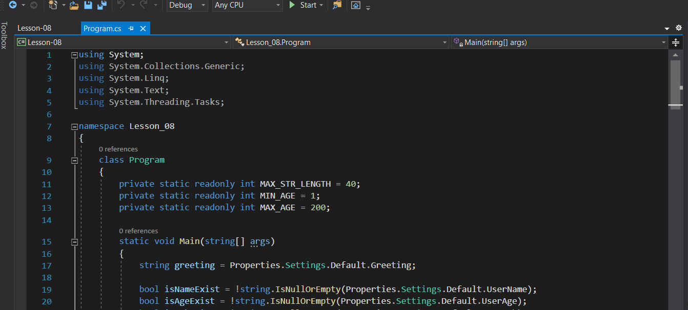

*[Назад](./../README.md)*  
  
### Задание для урока №8  
  
- [X] Создать консольное приложение, которое при старте выводит приветствие, записанное в настройках приложения (application-scope).  
- [X] Запросить у пользователя имя, возраст и род деятельности, а затем сохранить данные в настройках.  
- [X] При следующем запуске отобразить эти сведения.  
- [X] Задать приложению версию и описание.  
  
---  
  
### Пояснения по выполнению задания  
  
Задание выполнено.  
  
  
  
