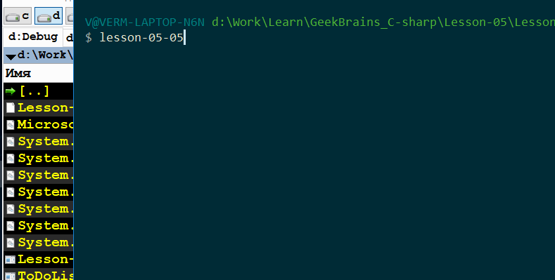

## Курс C# (GeekBrains)  
  
### Репозиторий предназначен для домашних заданий  
  
---
  
### Описания заданий и пояснения к их выполнению  
  
- **[Задание урока №1 - Работа с консолью.](./Lesson-01/readme.md)**  
  
- **[Задание урока №2 - Базовые типы. Ветвление. Области видимости.](./Lesson-02/readme.md)**  
  
- **[Задание урока №3 - Массивы. Строки. Циклы.](./Lesson-03/readme.md)**  
  
- **[Задание урока №4 - Методы. Стек вызовов.](./Lesson-04/readme.md)**  
  
- **[Задание урока №5 - Работа с файлами. Сериализация.](./Lesson-05/readme.md)**  
  
- **[Задание урока №6 - Обработка ошибок. Работа с процессами.](./Lesson-06/readme.md)**  
  
- **[Задание урока №7 - Инфраструктура .Net. IL-ассемблер. Дизассемблирование.](./Lesson-07/readme.md)**  
  
- **[Задание урока №8 - Основные сущности проектов .Net](./Lesson-08/readme.md)**  
  
---  
  
### Примеры работы некоторых программ:  
  
  
  
  
  
Курс окончен. Все домашние задания выполнены и проверены.  
  